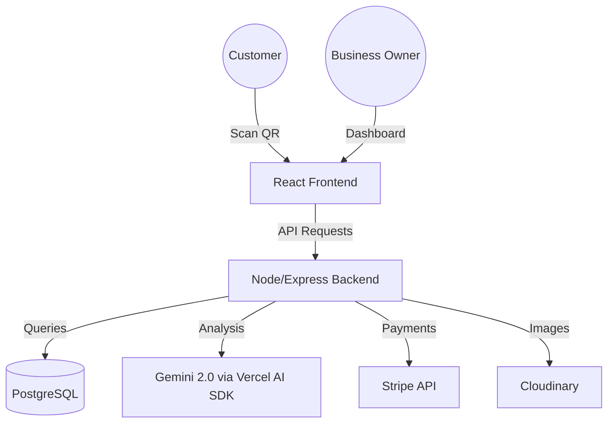

# AI Feedback Collector: Technical Deep Dive

## 🌟 Product Vision
The **AI Feedback Collector** is a SaaS platform designed to transform raw, overwhelming customer feedback into clear, actionable business intelligence. By leveraging a QR-code-driven collection method and advanced LLM analysis, it bridges the gap between customer voices and data-driven decisions.

---

## 🏗️ System Architecture

### High-Level Overview
The application is a two-package monorepo (`client/` + `server/`)with a PostgreSQL database, plus specialized third-party integrations for AI and Payments.

### Key Technical Decisions
- **AI Engine (Gemini 2.0 Flash)**: Chosen for its speed and native support for structured JSON output, which is critical for parsing sentiment and keywords.
- **Vite Proxy**: Used to eliminate CORS issues during development and provide a seamless dev experience.
- **Stripe Webhooks**: Implemented to ensure the application's subscription state is always in sync with the payment processor, handling edge cases like failed renewals and cancellations.
- **Better Auth**: Session-based authentication (email/password via Better Auth with the Prisma adapter), replacing custom JWT + refresh token handing.

---

## 📊 Database Schema

### Models & Relationships
1.  **User**: Auth + profile data (managed by Better Auth.>
    - *Link*: Can belong to many Organizations via memberships.
2.  **Organization**: Contains business details, custom AI categories, and a unique slug for the QR landing page.
    - *Link*: Belongs to many Users. Contains many Feedbacks.
3.  **Feedback**: Stores the raw message and AI-enriched analysis (sentiment, rating, keywords).
    - *Link*: Belongs to an Organization.
4.  **Subscription**: Persisted Stripe subscription state (plan, status, period end,, linked to an Organization).
    - *Link*: Belongs to an Organization.

---

## 🤖 AI Pipeline
The core "magic" happens in the `analyzeFeedback` pipeline:
1.  **Input**: Raw text from a customer.
2.  **Context**: The organization categories (used as the AI context)..
3.  **Processing**: A structured prompt is sent to `gemini-2.0-flash` with a strict JSON schema.
4.  **Enrichment**: The AI returns sentiment (Positive/Negative/Neutral), an inferred 1-5 rating, key themes, and an urgency score.
5.  **Storage**: The enriched data is saved, enabling real-time dashboard analytics.

---

## 💳 SaaS & Monetization
The app features a fully functional subscription engine:
- **Plans**: Basic and Pro tiers.
- **Access Control**: Middleware checks for active subscriptions and redirects users to a "Reactivate" or "Payment" page if their status is invalid.
- **Billing Portal**: Integrated Stripe Customer Portal allows users to manage their own billing without manual support.

---

## 🚀 Deployment Strategy
- **Local dev**: Docker Compose(client vite :5173, server tsx :5000, postgres :5434; hot reload.).
- **Production**: Containerized via Docker Compose prod stack(nginx + node + postgres, `prisma migrate deploy` auto-runs).
- **CI/CD**: GitHub Actions -- lint, typecheck, test, build,with a Postgres service).
