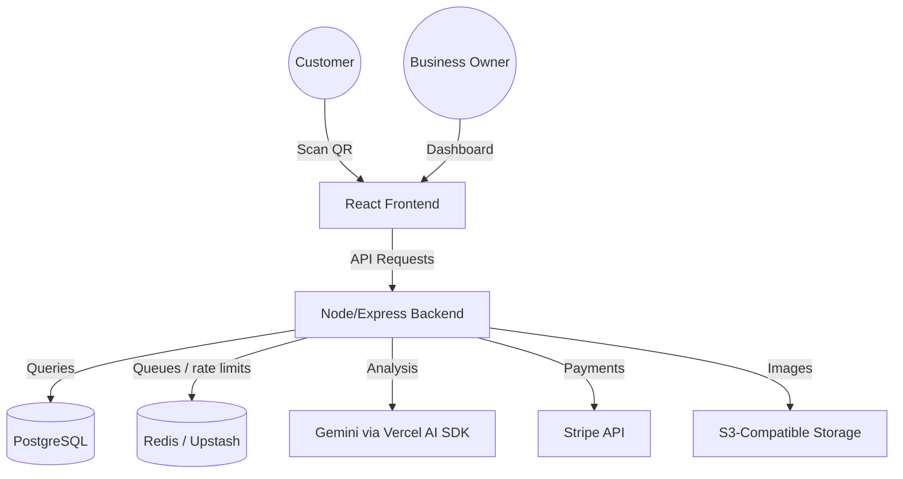

# AI Feedback Collector: Technical Deep Dive

## 🌟 Product Vision
The **AI Feedback Collector** is a SaaS platform designed to transform raw, overwhelming customer feedback into clear, actionable business intelligence. By leveraging a QR-code-driven collection method and advanced LLM analysis, it bridges the gap between customer voices and data-driven decisions.

---

## 🏗️ System Architecture

### High-Level Overview
The application is a three-package monorepo (`client/` + `server/` + `shared/`) with a PostgreSQL database, Redis-backed job queues, plus specialized third-party integrations for AI and Payments.



### Key Technical Decisions
- **AI Engine (Gemini Flash)**: Chosen for its speed and native support for structured JSON output, which is critical for parsing sentiment and keywords.
- **Vite Proxy**: Used to eliminate CORS issues during development and provide a seamless dev experience.
- **Stripe Webhooks**: Implemented to ensure the application's subscription state is always in sync with the payment processor, handling edge cases like failed renewals and cancellations.
- **Better Auth**: Session-based authentication (email/password via Better Auth with the Prisma adapter), replacing custom JWT + refresh token handing.

---

## 📊 Database Schema

### Models & Relationships
1.  **User**: Auth + profile data (managed by Better Auth.>
    - *Link*: Can belong to many Organizations via memberships.
2.  **Organization**: Contains business details, custom AI categories, and a unique slug for the QR landing page.
    - *Link*: Belongs to many Users. Contains many Feedbacks.
3.  **Feedback**: Stores the raw message and AI-enriched analysis (sentiment, urgency, rating, category, keywords, themes, root cause, suggested action, confidence — plus `satisfactionEstimate` 1–5, `fixableProblem`, `concreteIssue`, `retentionRisk`, `verified`, media and `costEstimate` fields), plus close-the-loop state (`open` | `in_progress` | `resolved` | `ignored`), internal notes, owner reply, and human corrections.
     - *Link*: Belongs to an Organization.
4.  **Subscription**: Persisted Stripe subscription state (plan, status, period end,, linked to an Organization).
    - *Link*: Belongs to an Organization.

---

## 🤖 AI Pipeline
The core "magic" happens in the `analyzeFeedback` pipeline:
1.  **Input**: Raw text from a customer.
2.  **Context**: The organization categories (used as the AI context)..
3.  **Processing**: A structured prompt is sent to `gemini-3.6-flash` with a strict JSON schema.
4.  **Enrichment**: The AI returns sentiment (Positive/Negative/Neutral/Mixed), an inferred 1-5 rating, key themes, an urgency score — plus `satisfactionEstimate` (1–5 outcome satisfaction, distinct from tone), `fixableProblem` + `concreteIssue`, and `retentionRisk` (Low/Medium/High). Missing structured fields are backfilled deterministically so old rows stay queryable.
5.  **Storage**: The enriched data is saved, enabling real-time dashboard analytics.

---

## 💳 SaaS & Monetization
The app features a fully functional subscription engine:
- **Plans**: Basic and Pro tiers.
- **Access Control**: AI Chat (`POST /api/ai/:slug/chat/stream`) and AI growth recommendations are Pro-gated server-side; other features serve all plans.
- **Billing Portal**: Integrated Stripe Customer Portal allows users to manage their own billing without manual support.

---

## 🚀 Deployment Strategy
- **Local dev**: Docker Compose (client vite :5173, server tsx :5000, postgres host :5434, redis host :6379; hot reload).
- **Production**: Containerized via Docker Compose prod stack (client nginx :3000, server node :5000, postgres internal-only; `prisma migrate deploy` auto-runs).
- **CI/CD**: GitHub Actions — lint, typecheck, test, build, with a Postgres service.

---

## 📦 Shared contracts (`@aifc/contracts`)

`shared/` is the single source of truth for validation: Zod v4 schemas re-exported from `shared/src/index.ts` and consumed by both `server/` and `client/` via `"@aifc/contracts": "file:../shared"` (compiled with `tsc` to `shared/dist/`).

Rules that follow from this:
- Install + build `shared/` before `client/`/`server` (`npm ci --legacy-peer-deps`, then `npm run build`); both packages auto-rebuild contracts via `build:contracts` hooks (`predev`/`prebuild`/`pretypecheck`/`pretest`).
- **All Dockerfiles use repo-root build context** so `file:../shared` resolves inside the image (`/app/shared`); `docker-compose.yml` bind-mounts `./shared` for hot reload (client runs `tsc --watch` in the background).

---

## 🎨 Frontend UI kit

No external component library — `client/src/components/ui/` is the shared kit (Tailwind v4 + `cn()`): `Button` (brand/secondary/outline/ghost/destructive/success/warning), `Card`, `PageHeader`, `Badge` (success/warning/destructive/info/neutral/muted), `Input`/`Textarea`/`Select`/`Field`, `Logo`, `Spinner`/`LoadingState`, `EmptyState`, `Drawer`, `Container`/`CenteredLayout`.

Conventions (enforced in review, not by tooling):
- Colors only via theme tokens (`primary/secondary/muted/accent/destructive/success/warning/chart-*`); no raw `slate/emerald/amber/red/pink` in pages.
- Cards `rounded-xl p-6`; inputs `bg-background rounded-lg`; hovers use `hover:bg-muted` (never `hover:bg-secondary/*`, which flashes navy in light mode).
- Theme tokens (`--success`, `--warning`, light + dark) live in `client/src/styles/index.css` (Tailwind v4 CSS-first, no config file).

---

## Reliability & Background Jobs (BullMQ + Redis / Upstash)

Heavy AI work (daily insight generation, future batch analysis) plus notification emails are offloaded from the HTTP request path via **BullMQ**.

| Piece | Role |
|-------|------|
| **Redis** (`REDIS_URL`) | Shared store for queues and distributed rate limiting. Local: `redis:7-alpine` in `docker-compose.yml`. Production: **Upstash** Redis (`rediss://…`). |
| **BullMQ** | Durable job queue. Queues: `aifc-insights`, `aifc-default`. Workers run in the same Node process (or can be split later). `aifc-default` carries `high-urgency-alert` + `send-digest-email` jobs. |
| **Email** (`SMTP_*`, `EMAIL_FROM`) | Nodemailer SMTP transport (`lib/mail.ts`). Immediate alerts fire on High urgency or satisfaction ≤ 2; a 7AM cron sends per-org digests (opt-out via org `settings.emailDigest`). Empty `SMTP_HOST` = sends skipped safely (logged). |
| **Fallback** | If `REDIS_URL` is unset or Redis is down, the app still boots: rate limits fall back to in-memory, the daily insight cron runs jobs **in-process**, and digests send inline. |

### Key files
- `server/src/lib/redis.ts` — shared ioredis client
- `server/src/lib/queue.ts` — queue helpers + job names
- `server/src/lib/mail.ts` — SMTP mail service (alerts + digests, no-op without `SMTP_HOST`)
- `server/src/workers/insights.worker.ts` — BullMQ worker for insight generation
- `server/src/workers/notification.worker.ts` — BullMQ worker for urgency alerts + digests
- `server/src/jobs/generateInsights.ts` — crons that enqueue (or fall back): 2AM insights, 7AM digest
- `server/src/middleware/rate-limit.ts` — Redis-backed `express-rate-limit` store when available

### Local setup
```bash
docker compose up -d redis   # or full stack
# server/.env
REDIS_URL=redis://localhost:6379
# Email (optional): local catcher on :1025, or leave SMTP_HOST empty to skip
SMTP_HOST=localhost
SMTP_PORT=1025
EMAIL_FROM=Feedwise <noreply@feedwise.app>
```

### Production (Upstash)
1. Create a Redis database on [upstash.com](https://upstash.com).
2. Copy the Redis URL (`rediss://…`) into `REDIS_URL`.
3. Deploy. Health check (`GET /health`) reports `"redis": "connected"`.

---

## Product loop (collect → understand → act)

### Collection (public page)
- Ultra-short form: feedback text + optional star rating + optional context chips
- Branded header (logo / name), mobile-first, anonymous by default
- Min length reduced to 5 characters to reduce drop-off

### Understanding (AI)
Structured analysis now includes:
- sentiment, urgency, category, rating, keyPoints, keywords
- **themes**, **rootCause**, **suggestedAction**, confidence
- **satisfactionEstimate** (1–5, distinct from tone), **fixableProblem** + **concreteIssue**, **retentionRisk**
- Dashboard badges for satisfaction / fixable / risk; list filters for the same
- Human correction endpoint: `PATCH /api/feedback/:slug/:id/correct`

### Action (close the loop)
- Status: `open` | `in_progress` | `resolved` | `ignored`
- Internal notes + optional owner reply
- Team page (`/dashboard/team`): invite staff by email, owner/admin/member roles
- Email push: high-urgency / low-satisfaction alerts + 7AM digest (SMTP, opt-out via org settings)
- Dashboard **“Top things to fix this week”** + **% acted on**
- Stats: `highUrgencyOpen`, `actedOnRate`, `topActions`

### Migration
Run after pull (compose runs `migrate deploy` on server start automatically):
```bash
cd server && npx prisma migrate deploy
# or for local dev:
npx prisma migrate dev
```
